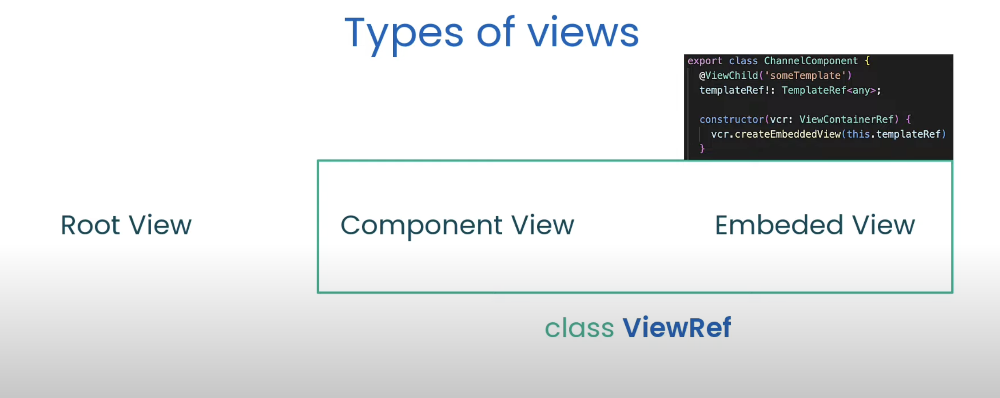
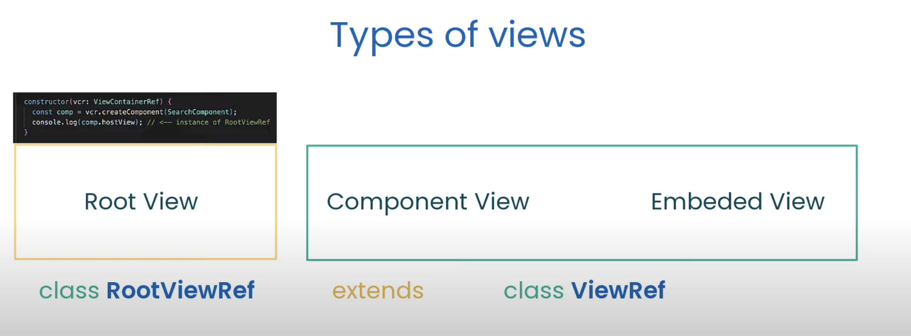
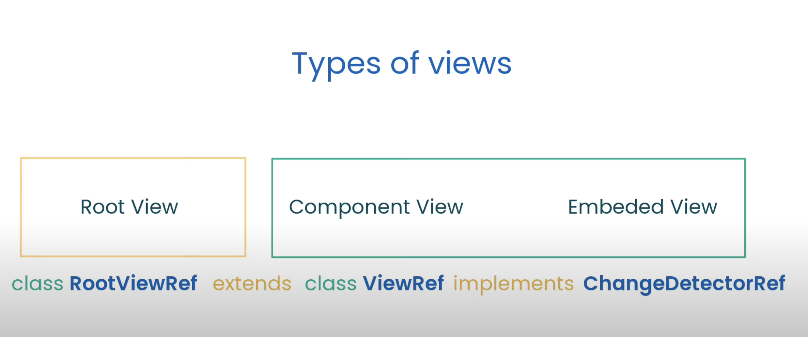
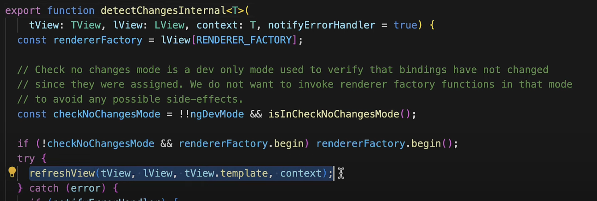
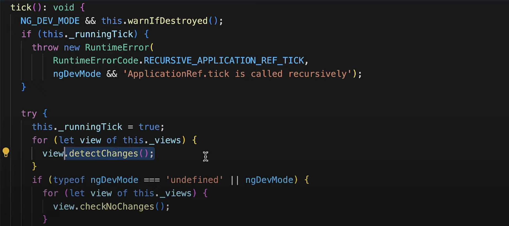

### View Checking:

**View Checking**: Synchronization of component view with the data model.
If we run `detectChanges()` method for their root-component like app-component then the View Checking will be performed for the whole application view tree.

####  `Typpes of Views`

#### `detectChanges()` internals

#### Initial View Checking will be happened when bootstrapping of application using `tick()`

### The Role of ZoneJS:

### References:
- Change Detection in Angular - Pt.1 View Checking: https://youtu.be/hZOauXaO8Z8
- Change Detection in Angular Pt.2 - The Role of ZoneJS: https://youtu.be/Ys7xdebd66Y
