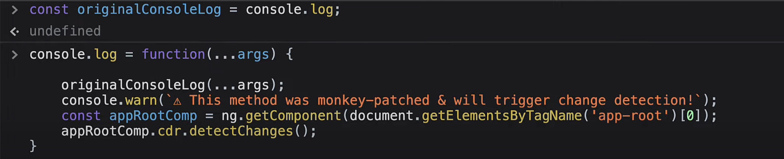
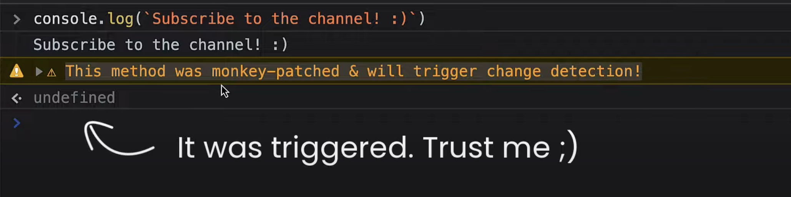
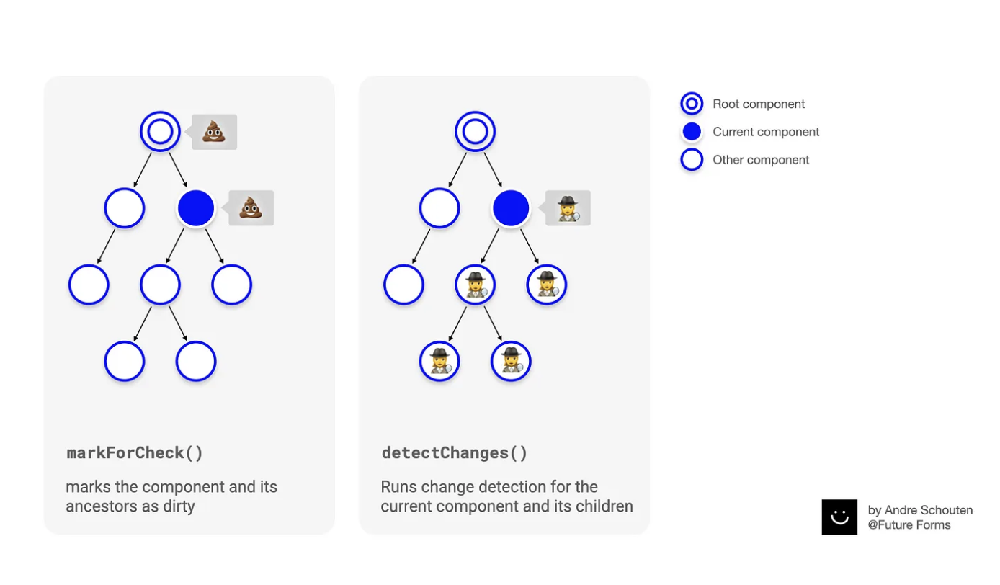
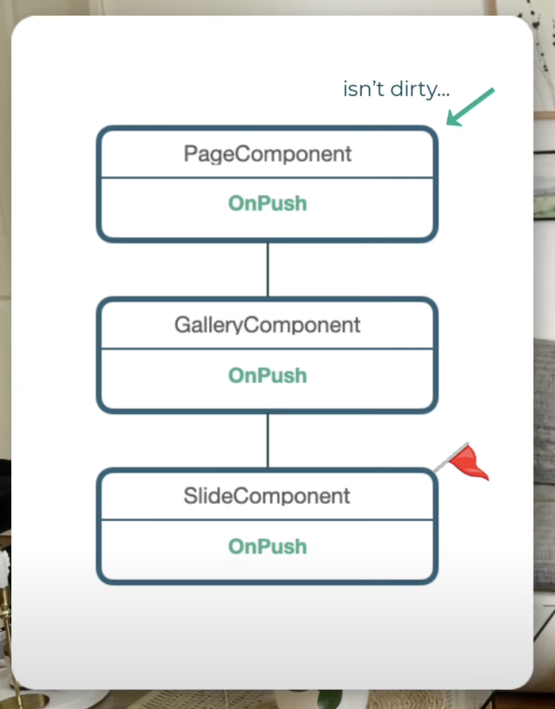
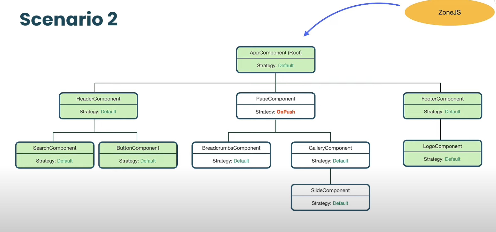
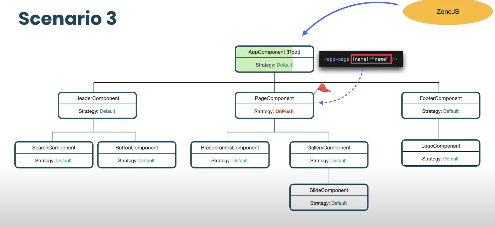
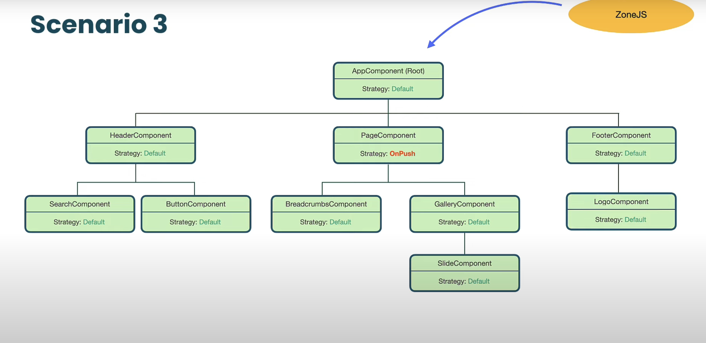
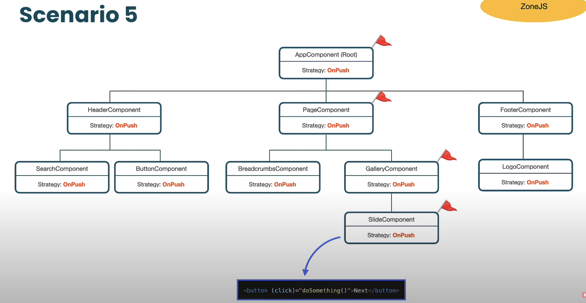
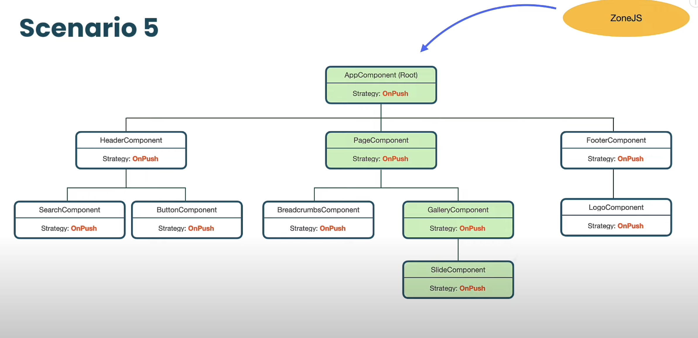
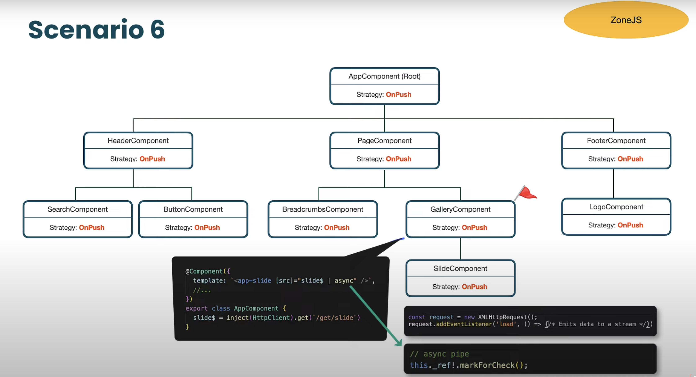

### View Checking:

**View Checking**: Synchronization of component view with the data model.
If we run `detectChanges()` method for their root-component like app-component then the View Checking will be performed for the whole application view tree.

####  `Typpes of Views`

#### `detectChanges()` internals

#### Initial View Checking will be happened when bootstrapping of application using `tick()`

### The Role of ZoneJS:
- To notify _Angular_ about _async_ event completion _zone.js_ uses technique called **monkey patching** to patch the browser's native API and bring some additional Behavior, some interceptors and hooks to it.
- Zone.js is a _signaling mechanism_ that Angular uses to detect when an application state might have changed. It captures asynchronous operations like setTimeout, network requests, and event listeners.
- Zone reference: https://javascript.plainenglish.io/angular-zone-js-3b5e2347b7
- How Zone works internally?
  
#### Monkey Patching example

### OnPush Change Detection Strategy

#### `markForCheck()` vs `detectChanges()`:

Reference: https://medium.com/@andre.schouten_ff/whats-the-difference-between-markforcheck-and-detectchanges-in-angular-fff4e5f54d34

#### Reason for marking parent & it's ancestor's dirty: 
If we don't mark all it's parent as dirty, in the below case CD doesn't happen for dirty component.

#### Should we call `markForCheck()` every time when a data model of the component changes?
There is a  couple of use cases when angular marks components as a dirty automatically so you don't have to  do it manually.
1. the first use case is when the component state is changing inside the `component event-handler` because during the compilation phase angular will wrap event listeners with a special internal function called _WrapListener_MarkDirtyAndPreventDefault_.
    The markForCheck() is being called automatically not only when native JS events are handled (e.g. click, scroll, etc) but also happens when the `output event` (@Output() + EventEmitter) is handled.
2. any `component @Input` is changing:  It happens during the view checking phase when Angular goes through template bindings & `component property-binding`.
3. when use `async` pipe, because under the hood async pipe uses markForCheck().
 
**Note:** By using onPush Change Detection, Angular will only check the tree if the **reference** passed to the component is changed instead of some property changed in the object.
  Therefore, updating value in setTimeout(), @Input & @Output works okay for `primitive values` but not for `reference types` like arrays ,objects etc.

 So..... 
**OnPush** itself means, only running the change detection if any of these has happened :
1. An `event` has fired, like a click or something like that or any of the child components has emitted an event.
   Events like :
   Click
   Keyup
   Subscription events
   etc.
2. One of the `@inputs` of the component has been completely replaced with a new value, or simply put if the reference of the @Input property has changed altogether.

#### Different Scenarios:

### References:
- Change Detection in Angular - Pt.1 View Checking: https://youtu.be/hZOauXaO8Z8
- Change Detection in Angular Pt.2 - The Role of ZoneJS: https://youtu.be/Ys7xdebd66Y
- Role of Zone & ZoneJS: https://youtu.be/4MP-bsrW0yo
- Change Detection in Angular Pt.3 - OnPush Change Detection Strategy: https://youtu.be/WAu7omIoerM
